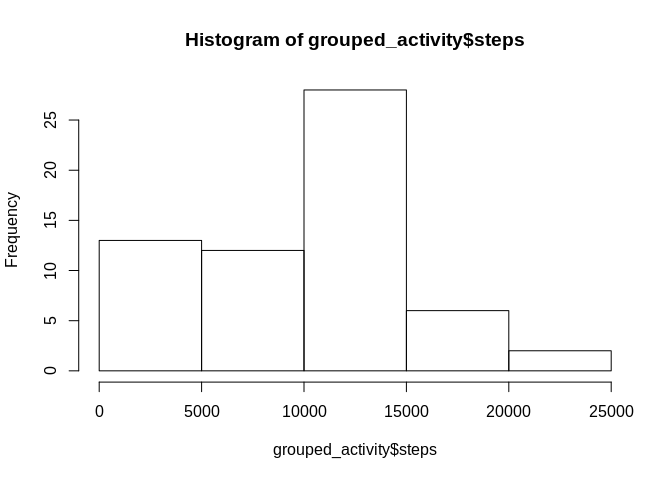
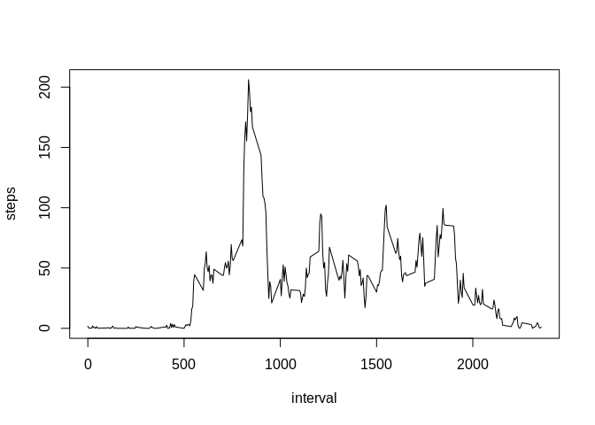
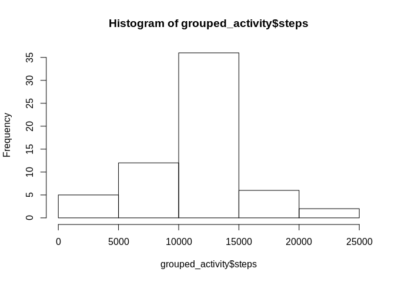
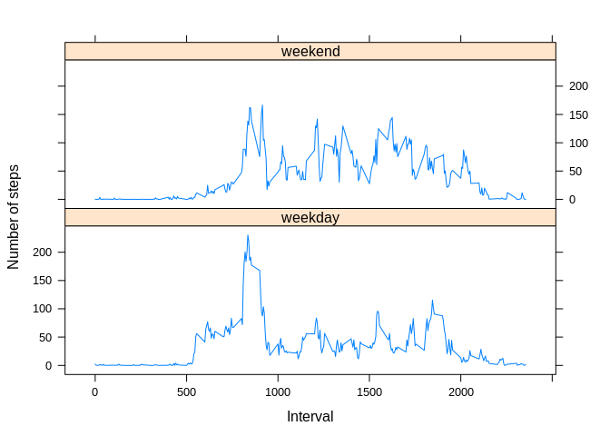

## Loading and preprocessing the data


```r
library(dplyr)
```

```
## 
## Attaching package: 'dplyr'
```

```
## The following objects are masked from 'package:stats':
## 
##     filter, lag
```

```
## The following objects are masked from 'package:base':
## 
##     intersect, setdiff, setequal, union
```

```r
activity <- read.csv(unz('activity.zip', 'activity.csv')) %>% mutate(interval=as.factor(interval))
print(str(activity))
```

```
## 'data.frame':	17568 obs. of  3 variables:
##  $ steps   : int  NA NA NA NA NA NA NA NA NA NA ...
##  $ date    : Factor w/ 61 levels "2012-10-01","2012-10-02",..: 1 1 1 1 1 1 1 1 1 1 ...
##  $ interval: Factor w/ 288 levels "0","5","10","15",..: 1 2 3 4 5 6 7 8 9 10 ...
## NULL
```

```r
print(head(activity))
```

```
##   steps       date interval
## 1    NA 2012-10-01        0
## 2    NA 2012-10-01        5
## 3    NA 2012-10-01       10
## 4    NA 2012-10-01       15
## 5    NA 2012-10-01       20
## 6    NA 2012-10-01       25
```

```r
print(summary(activity))
```

```
##      steps                date          interval    
##  Min.   :  0.00   2012-10-01:  288   0      :   61  
##  1st Qu.:  0.00   2012-10-02:  288   5      :   61  
##  Median :  0.00   2012-10-03:  288   10     :   61  
##  Mean   : 37.38   2012-10-04:  288   15     :   61  
##  3rd Qu.: 12.00   2012-10-05:  288   20     :   61  
##  Max.   :806.00   2012-10-06:  288   25     :   61  
##  NA's   :2304     (Other)   :15840   (Other):17202
```


## What is mean total number of steps taken per day?

1. Calculate the total number of steps taken per day


```r
grouped_activity <- activity %>% 
  group_by(date) %>%
  summarize(steps = sum(steps, na.rm = TRUE))
grouped_activity
```

```
## # A tibble: 61 x 2
##    date       steps
##    <fct>      <int>
##  1 2012-10-01     0
##  2 2012-10-02   126
##  3 2012-10-03 11352
##  4 2012-10-04 12116
##  5 2012-10-05 13294
##  6 2012-10-06 15420
##  7 2012-10-07 11015
##  8 2012-10-08     0
##  9 2012-10-09 12811
## 10 2012-10-10  9900
## # … with 51 more rows
```
Mean total number of steps taken per day: 9354.2295082

2. If you do not understand the difference between a histogram and a barplot, research the difference between them. Make a histogram of the total number of steps taken each day


```r
hist(grouped_activity$steps)
```

<!-- -->

3. Calculate and report the mean and median of the total number of steps taken per day


```r
paste('Total number of steps per day mean: ', mean(grouped_activity$steps, na.rm = TRUE))
```

```
## [1] "Total number of steps per day mean:  9354.22950819672"
```

```r
paste('Total number of steps per day median: ', median(grouped_activity$steps, na.rm = TRUE))
```

```
## [1] "Total number of steps per day median:  10395"
```

## What is the average daily activity pattern?

1. Make a time series plot of the 5-minute interval (x-axis) and the average number of steps taken, averaged across all days (y-axis)


```r
steps_by_interval <- activity %>% 
  group_by(interval) %>%
  summarize(steps = mean(steps, na.rm = TRUE)) %>%
  mutate(interval=as.numeric(as.character(interval)))
print(head(steps_by_interval))
```

```
## # A tibble: 6 x 2
##   interval  steps
##      <dbl>  <dbl>
## 1        0 1.72  
## 2        5 0.340 
## 3       10 0.132 
## 4       15 0.151 
## 5       20 0.0755
## 6       25 2.09
```

```r
plot(steps_by_interval, type="l")
```

<!-- -->

2. Which 5-minute interval, on average across all the days in the dataset, contains the maximum number of steps?


```r
max_step_interval <- steps_by_interval$interval[which.max(steps_by_interval$steps)]
```
5-minute interval 835 contains on average the maximum number of steps


## Imputing missing values

1. Calculate and report the total number of missing values in the dataset (i.e. the total number of rows with NAs)


```r
na_row_number <- nrow(activity) - nrow(na.omit(activity))
```
Total number of rows with NAs: 2304

2-3. All missing values will be filled in with the mean for that day:


```r
na_index <- is.na(activity$steps)
interval_index <- activity$interval[which(as.factor(steps_by_interval$interval) == activity$interval[na_index])]

get_steps_for_interval <- function(){
        step_array <- numeric(length(interval_index))
        for (i in 1:length(interval_index)) {
                step_array[i] <- (steps_by_interval$steps[which(steps_by_interval$interval == interval_index[i])])
        }
        return (step_array)
}

missing_values_length <- sum(na_index)
activity$steps[na_index] <- get_steps_for_interval()
do_missing_values_remain <- any(is.na(activity$steps))
```
Imputed 2304 missing values. Missing values remained: FALSE.

4. Histogram of the total number of steps


```r
grouped_activity <- activity %>% 
  group_by(date) %>%
  summarize(steps = sum(steps))
grouped_activity
```

```
## # A tibble: 61 x 2
##    date        steps
##    <fct>       <dbl>
##  1 2012-10-01 10766.
##  2 2012-10-02   126 
##  3 2012-10-03 11352 
##  4 2012-10-04 12116 
##  5 2012-10-05 13294 
##  6 2012-10-06 15420 
##  7 2012-10-07 11015 
##  8 2012-10-08 10766.
##  9 2012-10-09 12811 
## 10 2012-10-10  9900 
## # … with 51 more rows
```

```r
hist(grouped_activity$steps)
```

<!-- -->

```r
paste('Total number of steps per day mean: ', mean(grouped_activity$steps))
```

```
## [1] "Total number of steps per day mean:  10766.1886792453"
```

```r
paste('Total number of steps per day median: ', median(grouped_activity$steps))
```

```
## [1] "Total number of steps per day median:  10766.1886792453"
```

These values of mean and median differ from the first part of the assignment. 
Imputing missing dataincreased the estimates of the total daily number of steps.


## Are there differences in activity patterns between weekdays and weekends?


```r
library(magrittr)
day <- as.factor(ifelse(weekdays(as.Date(activity$date)) %in% c('Sunday', 'Saturday'), 'weekend', 'weekday'))
activity %<>% mutate(day=day)
print(summary(activity$day))
```

```
## weekday weekend 
##   12960    4608
```


```r
library(lattice)
by_intervals <- group_by(activity, interval)
summarized_splitted_activity <- rbind(summarize(filter(by_intervals, day == 'weekend'), steps = mean(steps), day = 'weekend'), summarize(filter(by_intervals, day == 'weekday'), steps = mean(steps), day = 'weekday'))
xyplot(steps ~ as.numeric(as.character(interval)) | day, data = summarized_splitted_activity, type='l', layout = c(1, 2), xlab = 'Interval', ylab='Number of steps') ## Plot with 2 panels
```

<!-- -->

